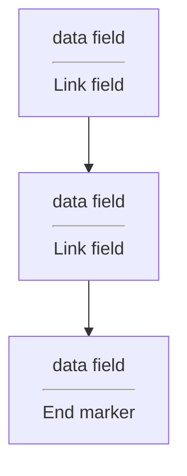

# Linked Lists
- A linked list is a sequence of items arranged one after another.
- Each node is a combination of data and link field

```cpp
class node{
public:
    typedef double value_type;
    ...
private:
    value_type data_field;
    node* link_field;
};
```
- in a linked list there must have a head_prt and tail_ptr
Sample constructor:
```cpp
node(const value_type& init_data = value_type(), node* init_link = NULL);
```

- the symbol "->" is called the *member selection operator"
- if p is a pointer to a class, and m is a member of the class, them p -> m means the same as *p.m
### In some cases
- const keyword means that the pointer c can't be used to change the node    
  pointer c can't be used to activate non-constat member functions
  pointer c can move and point to mant different nodes, but we are forbidden from using c to change any of those nodes that c points to
```cpp
const node* c;
```
- however, if you want to change you should put the const after *
  ```cpp
  node *const c = &first;
  ```
- When the return value of a member function is a pointer to a node, you should generally have two versions:
  A const version that returns a const node*
  An ordinary version that returns an ordinary pointer to a node
```cpp
const node* link() const{return link_field};
```
## Linked list toolkit
### Loop Detection
- Given a circulaf linked list, we cant to find the node at beginning of the loop by using **Floyd's cycle-finding alogorithm**

## Bag class with a linked list
- the class will have two private member variables
  - A head pointer
  - A variable
```cpp
private:
    node* head_ptr; // List head pointer
    size_type many_nodes; // Number of nodes on the list
```
### Bag header file
```cpp
class bag{
public:
    typedef std::size_t size_type;
    typedef node::value_type value type;
    bag();
    bag(const bag& source);
    ~bag();
    size_type erase(const value_type& target);
    bool erase_one(const value_type& target);
    void insert(const value_type& entry);
    void operator +=(const bag& addend);
    void operator =(const bag& source);
    size_type size() const {returm many_nodes;}
    size_type count(const value_type& target) const;
    value_type grab() const;
private:
    node* head_ptr;
    size_type many_nodes;
};
bag operator +(const bag& b1, const bag& b2);
```
- stop at ss5 P65