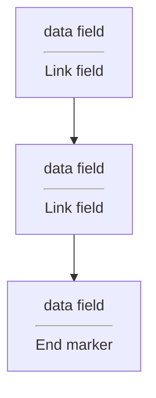

# Linked Lists
- A linked list is a sequence of items arranged one after another.
- Each node is a combination of data and link field

```cpp
class node{
public:
    typedef double value_type;
    ...
private:
    value_type data_field;
    node* link_field;
};
```
- in a linked list there must have a head_prt and tail_ptr
Sample constructor:
```cpp
node(const value_type& init_data = value_type(), node* init_link = NULL);
```

- the symbol "->" is called the *member selection operator"
- if p is a pointer to a class, and m is a member of the class, them p -> m means the same as *p.m
### In some cases
- const keyword means that the pointer c can't be used to change the node    
  pointer c can't be used to activate non-constat member functions
  pointer c can move and point to mant different nodes, but we are forbidden from using c to change any of those nodes that c points to
```cpp
const node* c;
```
- however, if you want to change you should put the const after *
  ```cpp
  node *const c = &first;
  ```
- When the return value of a member function is a pointer to a node, you should generally have two versions:
  A const version that returns a const node*
  An ordinary version that returns an ordinary pointer to a node
```cpp
const node* link() const{return link_field};
```
## Linked list toolkit
### Loop Detection
- Given a circulaf linked list, we cant to find the node at beginning of the loop by using **Floyd's cycle-finding alogorithm**

## Bag class with a linked list
- the class will have two private member variables
  - A head pointer
  - A variable
```cpp
private:
    node* head_ptr; // List head pointer
    size_type many_nodes; // Number of nodes on the list
```
### Bag header file
```cpp
class bag{
public:
    typedef std::size_t size_type;
    typedef node::value_type value type;
    bag();
    bag(const bag& source);
    ~bag();
    size_type erase(const value_type& target);
    bool erase_one(const value_type& target);
    void insert(const value_type& entry);
    void operator +=(const bag& addend);
    void operator =(const bag& source);
    size_type size() const {returm many_nodes;}
    size_type count(const value_type& target) const;
    value_type grab() const;
private:
    node* head_ptr;
    size_type many_nodes;
};
bag operator +(const bag& b1, const bag& b2);
```

```cpp
void bag::operator =(const bag& source){
  node* head_ptr;
  if(this == &source)
    return;
  many_nodes = 0;
  list_copy(source.head.ptr, head_ptr, tail_ptr);
  many_nodes = source.manynodes;
}
```
```cpp
bool bag::erase_one(const value_type& target){
  node* target_ptr;
  target_ptr = list_search(head_ptr, target);
  if (target_ptr == NULL)
    return false;
  target_ptr -> set_data(head_ptr -> data());
  --many_nodes;
  return true;
}

bag::size_type bag::count(const value_type& target) const{
  size_type answer = 0;
  const node* cur;
  cur = list_search(head_ptr, target);
  while(cur != NULL){
    ++answer;
    cur = cur -> link();
    cur = list_search(cur, target);
  }
  return answer;
}

value_type grab() const{
  size_type i;
  const node* cur;
  assert(size() > 0);
  i = (rand() % size()) + 1;
  cur = list_locate(head_ptr, i);
  return cur -> data();
}

void bag::operator +=(const bag& addend){
  node* copy_head_ptr;
  node* copy_tail_ptr;
  if(addend.many_nodes > 0){
    list_copy(addend.head_ptr, copy_head_ptr, copy_tail_ptr);
    copy_tail_ptr -> set_link(head_ptr);
    head_ptr = copy_head_ptr;
    many_nodes +=addend.many_nodes;
  }
}
```
# Dynamic Arrays, linked list, doubly linked list
## Arrays
- Arrays are better at random access
- These are constant time operations, but linked list will take O(n)

## Linked List
- better at insertions/deletions at a cursor
- doubly linked list are better for a two-way cursor
### In order to create a doubly linked list:
```cpp
//doubly linked list
dnode(const value_type& init_data = value_type(), denode* init_fore = NULL, denode* init_back = NULL){
  data_field = init_data;
  linked_fore = init_fore;
  linked_back = init_back;
}

void set_data(const value_type& new_data){return data_field = new_data; }
void set_fore(denode* new_fore){return linked_fore = new_fore;}
void set_back(denode* new_back){return linked_back = new_back;}
value_type data(){return data_field;}
const denode* fore(){const linked_fore;}
denode* fore(){linked_fore;}
const denode* back(){const linked_back;}
denode* back*(){linked_back;}

private:
  value_type data_field;
  denode* linked_fore;
  denode* linked_back;

//linked list
node(const value_tyep& init_data = value_type(), node* init_link = NULL);
```
